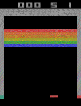

# Projet d'apprentissage profond par renforcement

Le code se trouve sous forme d'un notebook jupyter. Il est issu de [google colab](https://colab.research.google.com) et il est conseillé de l'y importer afin d'assurer un fonctionnement immédiat avec toutes les dépendances satisfaites.

Un rapport est également présent sous forme de fichier PDF, ainsi que différents GIFs montrant des exemples de parties après 10h d'entraînement sans prioritized experience replay, ou 5h avec.

Résultat du DQN avec 10h d'entrainement  

Résultats avec prioritized experiences replay et 5h d'entrainement  

